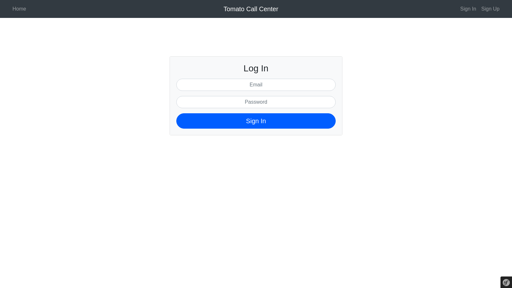
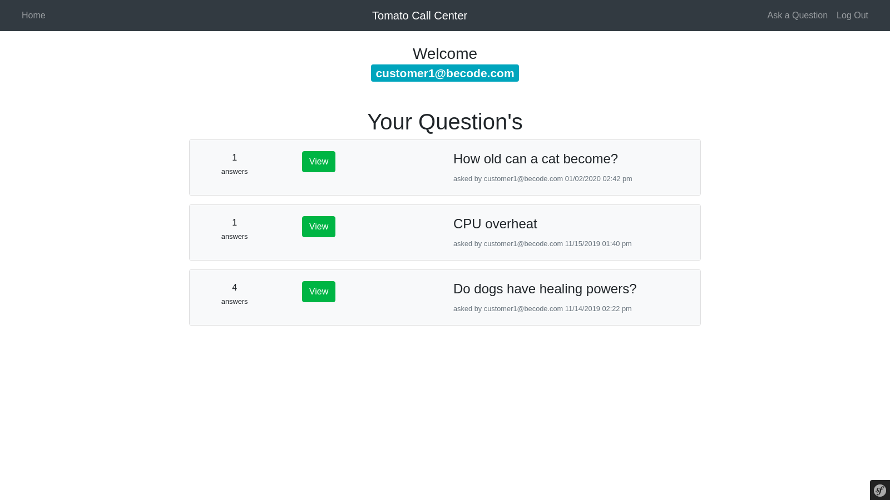
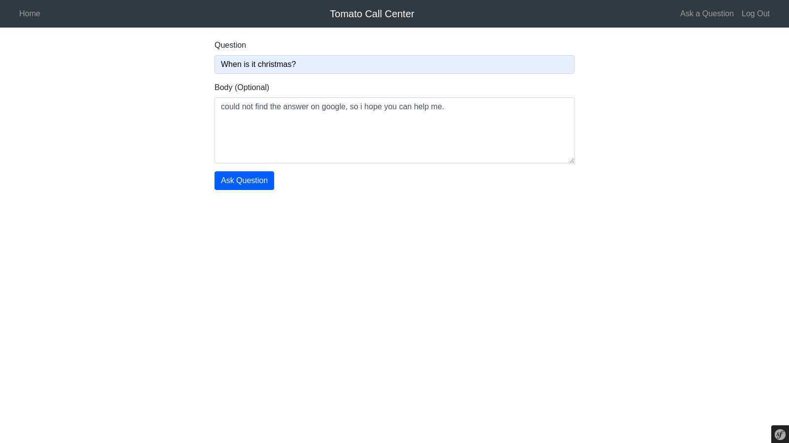
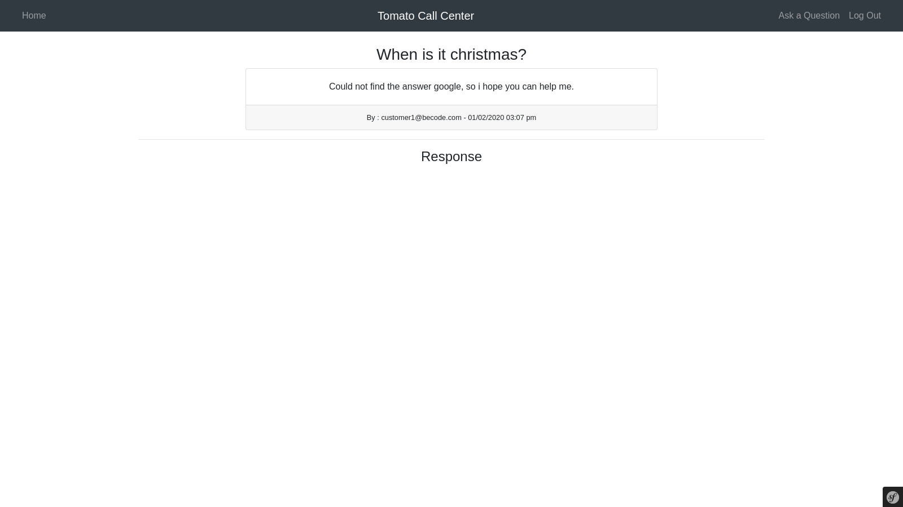
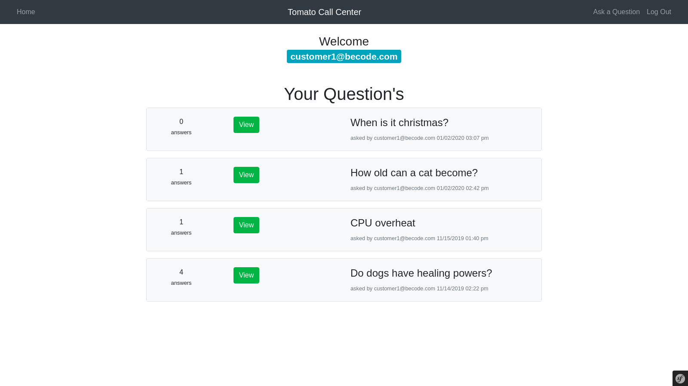
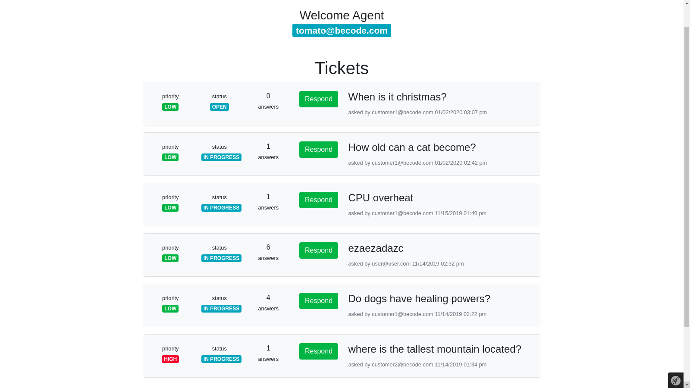
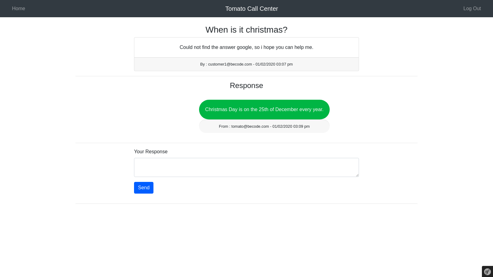
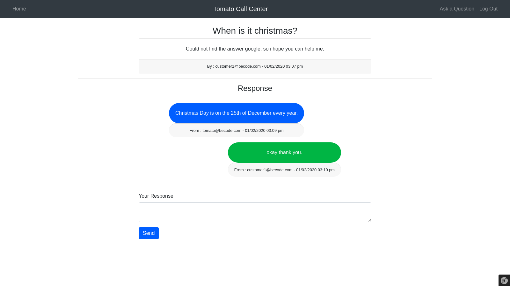

# Symfony-chat-support-system
A small symfony project made to answer questions from customers.
The goal was to make a site where a agent can answer customers question's while also changing their priority depending on the situation.
This is my first small project in Symfony 4.2.12.

# Technologies used in Symfony
- Doctrine
- Composer
- Twig

# Functionality
- Able to login & register
- Has separate dashboards for specific users
- Posting of tickets/questions
- Chat like UI when answering and asking questions
- Changing of priority
- Has a status to see what is happening (open, in progress, closed)

/ - To be implemented -/
- Admin dashboard to remove agents or customers
- Remove questions/tickets via a button
- Page to view all users registered 
- Set time event when a question/ticket is closed to be re-opened before 1 hour has passed (if the customer demands).
- Page to change a normal user to a agent or second-line agent.

# Screenshots

Sign In page

Customer dashboard with questions.

Customer ask's a Question.

Customer Question submitted.

Customer dashboard with the newly asked question

The Agent Dashboard

When the agent respnonds back to a question .

The result the customer gets.

